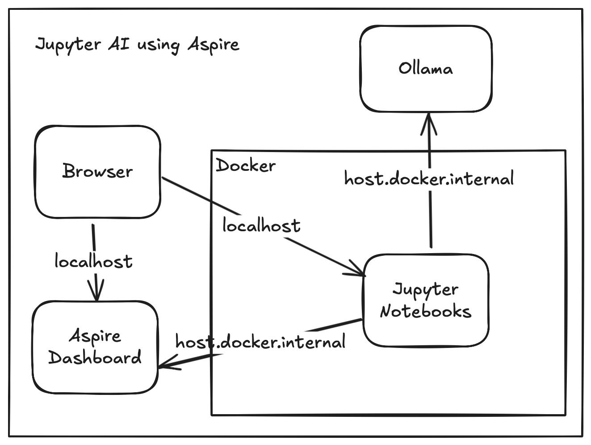
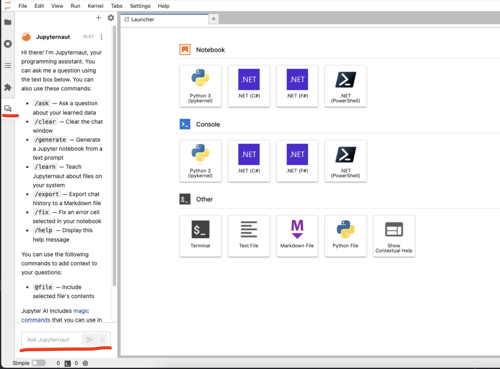

# Running Jupyter Notebooks with Jupyter AI support with .NET Aspire and Ollama

Brief demonstration of how to use Local Coding Assistant models with Jupyter Notebook.

System components:

- Ollama
  - Running as a container or running as an executable on host machine or accessible from local network. 
  - Models:
    - qwen2.5-coder:32b when Ollama is running on host
    - command-r7b when Ollama is running as container without acceleration
    - chatgpt-4o-latest when using OpenAI
- Juyter Notebooks
  - With support for .NET Interactive as a Jupyter kernel
  
- Aspire Solution



## Running the solution

- clone the repository
- launch the solution
- select a configuration from launch settings
  - if OpenAI selected, set user secrets as described below
- run the solution
- Once containers are built and started, click on Jupyter end point in dashboard.
- Open a notebook from work directory
- Access JupyterAI chat interface from the left panel and use the chat interface to generate code.




## Configuration

[launchSettings.json](./src/AspireJupyterAI.AppHost/Properties/launchSettings.json) has the following configurations allowing different models depending on capabilities of host to ber enabled.

### http-ollama-host

This is the configuration where Aspire will not spin up Ollama container. instead it will connect to an Ollama host that runs on the host (or optionally on the local network)

In this configuration, Ollama is assumed to be running on the host machine and has the necessary models pulled.
The connection happens via host.docker.internal:11434 and using the default port on host.

### http-ollama-local

In this case Ollama will be managed by .NET Aspire and we will spin up a container resource for it. Then the correct connection strings will be injected into Jupyter out of the box.

### http-openai

In this case we will not spin up Ollama but use OpenAI instead.
For this to work, in the use secrets for AppHost, the following value needs to be added:

```json
{
  "Parameters:OpenAIKey": "your API key"
}
```
Once the secret is set, it will be passed to the Jupyter container and will be configured automatically using [the referenced bash script that starts jupyter server in the container](./src/AspireJupyterAI.AppHost/Jupyter/run.sh)


## Sources:

- [NotebookswithJupyter.md](https://github.com/dotnet/interactive/blob/main/docs/NotebookswithJupyter.md)
- [jupyter-ai](https://github.com/jupyterlab/jupyter-ai)